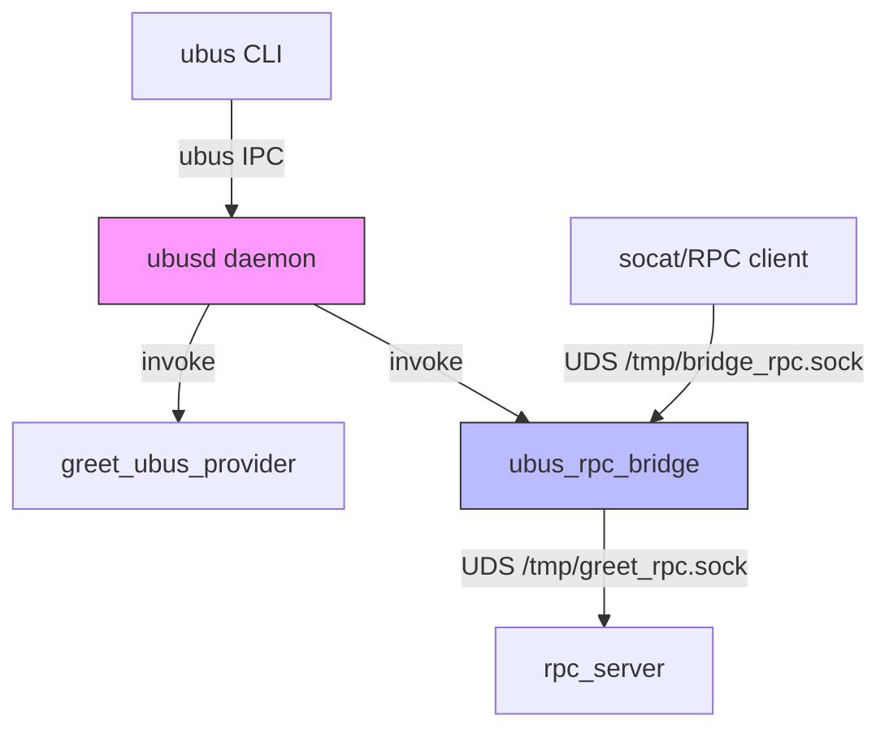

# DESIGN.md

## Architecture Overview



## Components

| Component               | Role                     | Technology          |
|-------------------------|--------------------------|---------------------|
| **ubusd**               | IPC bus daemon           | OpenWrt core        |
| **greet_ubus_provider** | Provides `greet.welcome` | C, libubus          |
| **rpc_server**          | JSON-RPC over UDS        | C, json-c           |
| **ubus_rpc_bridge**     | Bidirectional translator | C, libubus, json-c  |

## Data Flow

### Direction B: ubus -> RPC
```
ubus CLI 
  -> ubusd 
    -> bridge (rpc_greet.welcome handler)
      -> rpc_server (/tmp/greet_rpc.sock)
        -> reply: "Hello From RPC!"
          -> bridge (blobmsg)
            -> ubus CLI
```

### Direction A: RPC -> ubus
```
socat 
  -> bridge listener (/tmp/bridge_rpc.sock)
    -> ubusd 
      -> greet_ubus_provider (greet.welcome)
        -> reply: "Hello [name], Welcome to XYZ Company"
          -> bridge (JSON-RPC format)
            -> socat
```

## Algorithm

### Bridge Handler (Direction B)
```
1. Parse ubus request -> extract name
2. Connect to /tmp/greet_rpc.sock
3. Send JSON: {"id":1,"method":"greet.welcome","params":{"name":"..."}}
4. Read JSON response
5. Extract result.message
6. Convert to blobmsg -> ubus_send_reply()
```

### Bridge Listener (Direction A)
```
1. Accept connection on /tmp/bridge_rpc.sock
2. Read JSON-RPC request
3. ubus_lookup_id("greet")
4. ubus_invoke("greet", "welcome", {"name":"..."})
5. Wait for ubus callback
6. Build JSON: {"id":X,"result":{"message":"..."},"error":null}
7. Write to client socket
```

## Protocol Translation

| ubus (blobmsg)                  | JSON-RPC                                                  |
|---------------------------------|-----------------------------------------------------------|
| `{"name":"X"}` -> invoke        | `{"id":1,"method":"greet.welcome","params":{"name":"X"}}` |
| reply: `{"message":"Y"}`        | `{"id":1,"result":{"message":"Y"},"error":null}`          |
| `UBUS_STATUS_INVALID_ARGUMENT`  | `{"error":{"code":400,"message":"..."},"result":null}`    |

## Error Handling

| Error Condition                       | Response                                      |
|---------------------------------------|-----------------------------------------------|
| RPC server unreachable (Direction B)  | `UBUS_STATUS_UNKNOWN_ERROR` + log_error       |
| ubus greet not found (Direction A)    | `{"error":{"code":500,"message":"..."}}`      |
| Missing name parameter                | `UBUS_STATUS_INVALID_ARGUMENT` or `error:400` |


## Limitations

- **Single-threaded**: One request at a time per direction
- **Synchronous**: Blocking I/O (3s timeout on ubus_invoke)
- **One request per connection**: RPC server closes after each response
- **No authentication**: No user/group validation
- **Simplified Direction A**: Does not wait for actual ubus callback reply

## Testing

```bash
# Direction B
ubus call rpc_greet welcome '{"name":"Test"}' 
# Expected: {"message":"Hello From RPC!"}

# Direction A  
echo '{"id":1,"method":"greet.welcome","params":{"name":"Test"}}' | socat - UNIX-CONNECT:/tmp/bridge_rpc.sock
# Expected: {"id":1,"result":{"message":"Hello Test, Welcome to XYZ Company"},"error":null}
```